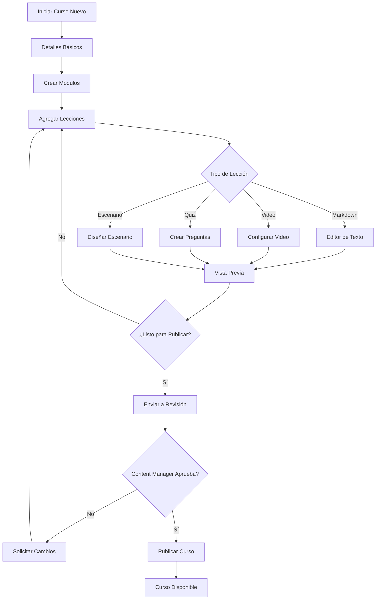

# Arquitectura de Experiencia de Administración - AccessLearn

**Fecha**: 20 de Noviembre, 2025  
**Versión**: 1.0  
**Estado**: Planning & Design

---

## 📋 Índice

1. [Visión General](#visión-general)
2. [Sistema de Roles y Permisos](#sistema-de-roles-y-permisos)
3. [Módulos Principales](#módulos-principales)
4. [Flujos de Usuario](#flujos-de-usuario)
5. [Arquitectura Técnica](#arquitectura-técnica)
6. [Plan de Implementación](#plan-de-implementación)

---

## 🎯 Visión General

### Objetivo
Crear una experiencia de administración **profesional, intuitiva y escalable** que permita a diferentes tipos de usuarios gestionar contenido, usuarios y obtener insights del sistema sin comprometer la seguridad ni la experiencia de aprendizaje.

### Principios de Diseño
1. **Separación de Concerns**: Roles claramente definidos con permisos granulares
2. **Progressive Disclosure**: Mostrar solo lo necesario según el rol y contexto
3. **Self-Service**: Empoderar a los creadores de contenido sin intervención técnica
4. **Data-Driven**: Decisiones basadas en métricas y analytics claros
5. **Compliance First**: Auditoría y trazabilidad en todas las operaciones críticas

---

## 🔐 Sistema de Roles y Permisos

### Jerarquía de Roles

```
Super Admin (Platform Level)
  ├── Tenant Admin (Organization Level)
  │   ├── Content Manager (Course Creation & Management)
  │   ├── User Manager (User Administration)
  │   └── Analytics Viewer (Read-only Analytics)
  ├── Instructor / Content Creator (Course Authoring)
  ├── Mentor (Student Guidance)
  └── Student (Learning Experience)
```

### Matriz de Permisos

| Capacidad | Super Admin | Tenant Admin | Content Manager | User Manager | Analytics Viewer | Instructor | Mentor | Student |
|-----------|-------------|--------------|-----------------|--------------|------------------|------------|--------|---------|
| **Tenant Management** |
| Crear tenants | ✅ | ❌ | ❌ | ❌ | ❌ | ❌ | ❌ | ❌ |
| Configurar tenant | ✅ | ✅ | ❌ | ❌ | ❌ | ❌ | ❌ | ❌ |
| Ver todos los tenants | ✅ | ❌ | ❌ | ❌ | ❌ | ❌ | ❌ | ❌ |
| **User Management** |
| Crear usuarios | ✅ | ✅ | ❌ | ✅ | ❌ | ❌ | ❌ | ❌ |
| Editar usuarios | ✅ | ✅ | ❌ | ✅ | ❌ | ❌ | ❌ | ❌ |
| Eliminar usuarios | ✅ | ✅ | ❌ | ✅ | ❌ | ❌ | ❌ | ❌ |
| Asignar roles | ✅ | ✅ | ❌ | ✅ | ❌ | ❌ | ❌ | ❌ |
| Ver lista de usuarios | ✅ | ✅ | ❌ | ✅ | ✅ | ❌ | ❌ | ❌ |
| **Course Management** |
| Crear cursos | ✅ | ✅ | ✅ | ❌ | ❌ | ✅ | ❌ | ❌ |
| Editar cursos propios | ✅ | ✅ | ✅ | ❌ | ❌ | ✅ | ❌ | ❌ |
| Editar cualquier curso | ✅ | ✅ | ✅ | ❌ | ❌ | ❌ | ❌ | ❌ |
| Eliminar cursos | ✅ | ✅ | ✅ | ❌ | ❌ | ❌ | ❌ | ❌ |
| Publicar cursos | ✅ | ✅ | ✅ | ❌ | ❌ | ⚠️ (requiere aprobación) | ❌ | ❌ |
| Archivar cursos | ✅ | ✅ | ✅ | ❌ | ❌ | ❌ | ❌ | ❌ |
| **Enrollment & Assignment** |
| Asignar cursos individuales | ✅ | ✅ | ✅ | ✅ | ❌ | ❌ | ❌ | ❌ |
| Asignar cursos masivos | ✅ | ✅ | ❌ | ✅ | ❌ | ❌ | ❌ | ❌ |
| Gestionar grupos | ✅ | ✅ | ❌ | ✅ | ❌ | ❌ | ❌ | ❌ |
| Crear equipos | ✅ | ✅ | ❌ | ✅ | ❌ | ❌ | ❌ | ❌ |
| **Analytics & Reports** |
| Ver analytics completo | ✅ | ✅ | ❌ | ❌ | ✅ | ❌ | ❌ | ❌ |
| Exportar reportes | ✅ | ✅ | ❌ | ❌ | ✅ | ❌ | ❌ | ❌ |
| Ver progreso individual | ✅ | ✅ | ❌ | ✅ | ✅ | ✅ (sus cursos) | ✅ (sus mentees) | ❌ |
| Ver métricas de curso | ✅ | ✅ | ✅ (sus cursos) | ❌ | ✅ | ✅ (sus cursos) | ❌ | ❌ |
| **Content Library** |
| Subir assets | ✅ | ✅ | ✅ | ❌ | ❌ | ✅ | ❌ | ❌ |
| Gestionar biblioteca | ✅ | ✅ | ✅ | ❌ | ❌ | ❌ | ❌ | ❌ |
| **Gamification** |
| Configurar XP | ✅ | ✅ | ❌ | ❌ | ❌ | ❌ | ❌ | ❌ |
| Crear badges | ✅ | ✅ | ✅ | ❌ | ❌ | ✅ | ❌ | ❌ |
| Gestionar leaderboards | ✅ | ✅ | ❌ | ❌ | ❌ | ❌ | ❌ | ❌ |
| **Mentorship** |
| Configurar programa | ✅ | ✅ | ❌ | ✅ | ❌ | ❌ | ❌ | ❌ |
| Ver todas las sesiones | ✅ | ✅ | ❌ | ✅ | ✅ | ❌ | ❌ | ❌ |
| **Settings & Configuration** |
| Configurar branding | ✅ | ✅ | ❌ | ❌ | ❌ | ❌ | ❌ | ❌ |
| Configurar notificaciones | ✅ | ✅ | ❌ | ❌ | ❌ | ❌ | ❌ | ❌ |
| Configurar idiomas | ✅ | ✅ | ❌ | ❌ | ❌ | ❌ | ❌ | ❌ |
| **Learning Experience** |
| Tomar cursos | ✅ | ✅ | ✅ | ✅ | ✅ | ✅ | ✅ | ✅ |
| Ver biblioteca personal | ✅ | ✅ | ✅ | ✅ | ✅ | ✅ | ✅ | ✅ |
| Solicitar mentoría | ✅ | ✅ | ✅ | ✅ | ✅ | ✅ | ❌ | ✅ |

**Leyenda:**
- ✅ Permiso completo
- ⚠️ Permiso condicional (requiere aprobación)
- ❌ Sin permiso

---

## 📦 Módulos Principales

### 1. Dashboard Principal (Admin Home)

**Componente**: `AdminDashboardV2.tsx`

#### Secciones

1. **Key Performance Indicators (KPIs)**
   - Total de usuarios activos
   - Tasa de completación general
   - XP total otorgado
   - Cursos publicados vs drafts
   - Sesiones de mentoría activas
   - Compliance score (cursos mandatorios completados)

2. **Quick Actions**
   - Crear curso nuevo
   - Agregar usuario
   - Asignar cursos masivamente
   - Ver analytics
   - Gestionar equipos
   - Configuración de tenant

3. **Recent Activity Feed**
   - Cursos completados recientemente
   - Nuevos usuarios registrados
   - Solicitudes de mentoría pendientes
   - Cursos publicados
   - Alertas de sistema

4. **Alerts & Notifications**
   - Cursos con baja tasa de completación
   - Usuarios inactivos > 30 días
   - Contenido pendiente de revisión
   - Problemas técnicos reportados

#### Wireframe ASCII
```
┌─────────────────────────────────────────────────────────────────┐
│                    Admin Dashboard - AccessLearn                │
├─────────────────────────────────────────────────────────────────┤
│ KPIs                                                            │
│ ┌──────────┬──────────┬──────────┬──────────┐                 │
│ │ 150      │ 85%      │ 45,230   │ 32       │                 │
│ │ Usuarios │Completión│ XP Total │ Cursos   │                 │
│ └──────────┴──────────┴──────────┴──────────┘                 │
│                                                                 │
│ Quick Actions                                                   │
│ ┌─────────────┬─────────────┬─────────────┬─────────────┐    │
│ │ + Create    │ + Add User  │ 📊 Analytics│ ⚙️ Settings │    │
│ │   Course    │             │             │             │    │
│ └─────────────┴─────────────┴─────────────┴─────────────┘    │
│                                                                 │
│ ┌──────────────────────┬──────────────────────────────────┐  │
│ │ Recent Activity      │ Alerts & Notifications           │  │
│ │ • Juan completó...   │ ⚠️ 5 users inactive >30 days    │  │
│ │ • María se unió...   │ ⚠️ "React 101" low completion   │  │
│ │ • Curso "Vue 3"...   │ ✅ All compliance courses OK    │  │
│ └──────────────────────┴──────────────────────────────────┘  │
└─────────────────────────────────────────────────────────────────┘
```

---

### 2. Course Authoring System (Content Creator Hub)

**Componente**: `CourseAuthoringStudio.tsx`

#### Características Principales

1. **Course Builder**
   - Editor WYSIWYG para lecciones markdown
   - Integración con video providers (YouTube, Vimeo, custom)
   - Quiz creator con múltiples tipos de preguntas
   - Escenarios interactivos (scenario-solver)
   - Vista previa en tiempo real
   - Auto-guardado cada 30 segundos

2. **Content Management**
   - Biblioteca de assets (imágenes, videos, documentos)
   - Templates reutilizables (lecciones, módulos completos)
   - Versionado de contenido
   - Colaboración multi-autor
   - Comentarios y sugerencias

3. **Publishing Workflow**
   ```
   Draft → Review → Approved → Published → Archived
   ```
   
   - **Draft**: Trabajo en progreso, solo visible para el autor
   - **Review**: Pendiente de aprobación por Content Manager/Admin
   - **Approved**: Listo para publicar pero aún no visible
   - **Published**: Visible y disponible para estudiantes
   - **Archived**: No visible pero mantenido por compliance

4. **Quality Checklist**
   Antes de publicar, el sistema verifica:
   - [ ] Título y descripción completos
   - [ ] Al menos 1 módulo con 1 lección
   - [ ] Objetivos de aprendizaje definidos
   - [ ] XP total configurado
   - [ ] Cover image presente
   - [ ] Nivel de dificultad asignado
   - [ ] Categoría seleccionada
   - [ ] Estimación de tiempo realista

5. **Analytics del Curso (Vista Instructor)**
   - Tasa de inscripción
   - Tasa de completación por módulo
   - Tiempo promedio de completación
   - Puntuación promedio en quizzes
   - Feedback de estudiantes
   - Puntos de abandono (drop-off points)

#### Flujo de Creación



---

### 3. User Management System

**Componente**: `UserManagementV2.tsx`

#### Features

1. **User Directory**
   - Búsqueda avanzada (nombre, email, rol, status)
   - Filtros por: rol, equipo, status, fecha de registro
   - Vista de tabla con paginación
   - Vista de tarjetas con avatares
   - Acciones bulk (activar/desactivar, asignar cursos)

2. **User Creation & Import**
   - Crear usuario individual
   - Importar CSV masivo
   - Validación de CURP/RFC/NSS (México)
   - Asignación automática a equipos
   - Envío de email de bienvenida

3. **User Profile Management**
   - Editar información personal
   - Cambiar rol (con confirmación)
   - Ver historial de cursos
   - Ver progreso actual
   - Resetear contraseña
   - Activar/desactivar cuenta

4. **Enrollment Management**
   - Asignar cursos individuales
   - Asignar por grupo/equipo
   - Establecer fechas límite
   - Marcar como obligatorio
   - Ver compliance status

5. **Groups & Teams**
   - Crear grupos (ej: "Ventas", "TI", "Nuevos Ingresos")
   - Asignar usuarios a grupos
   - Asignar cursos a grupo completo
   - Ver estadísticas de grupo
   - Gestionar team leaders

---

### 4. Analytics & Reporting Dashboard

**Componente**: `AnalyticsDashboardV2.tsx`

#### Reportes Principales

1. **High-Level Overview**
   - Total usuarios activos / seats disponibles
   - Tasa de completación plataforma
   - Top 5 usuarios más activos
   - Top 5 cursos más populares
   - Compliance at-a-glance

2. **User Progress Report**
   - Buscar usuario específico
   - Filtrar por equipo/departamento
   - Ver todos los cursos asignados
   - Ver progreso curso por curso
   - Exportar a CSV

3. **Course Analytics Report**
   - Seleccionar curso
   - Ver todos los usuarios inscritos
   - Tasa de completación
   - Tiempo promedio
   - Score promedio en quizzes
   - Puntos de abandono
   - Exportar a CSV

4. **Team Performance Report**
   - Seleccionar equipo
   - Tasa de completación del equipo
   - XP total del equipo
   - Desglose por miembro
   - Comparación entre equipos
   - Exportar a CSV

5. **Assessment Analytics Report**
   - Seleccionar quiz específico
   - Análisis pregunta por pregunta
   - Tasa de respuestas correctas/incorrectas
   - Identificar preguntas problemáticas
   - Total de intentos y pass rate
   - Exportar a CSV

6. **Mentorship Analytics Report**
   - Total de sesiones activas
   - Mentores más solicitados
   - Temas más comunes
   - Ratings promedio
   - Tiempo promedio de respuesta
   - Exportar a CSV

7. **Compliance Report**
   - Cursos mandatorios
   - Usuarios con compliance al día
   - Usuarios con compliance vencido
   - Alertas de vencimiento próximo
   - Historial de compliance
   - Exportar para auditoría

#### Exportación de Datos
- CSV para Excel
- JSON para integraciones
- PDF para presentaciones ejecutivas
- Scheduled reports (futuro)

---

### 5. Settings & Configuration

**Componente**: `TenantSettings.tsx`

#### Configuraciones Disponibles

1. **Branding**
   - Logo de la empresa
   - Colores primarios/secundarios
   - Fuente personalizada
   - Favicon
   - Email templates

2. **Notifications**
   - Configurar emails automáticos
   - Recordatorios de cursos
   - Notificaciones de progreso
   - Alertas de compliance
   - Configurar webhooks (futuro)

3. **Gamification**
   - Configurar valores de XP
   - Crear badges personalizados
   - Configurar niveles
   - Habilitar/deshabilitar leaderboards
   - Configurar achievements

4. **Compliance & Security**
   - Definir cursos mandatorios
   - Establecer períodos de renovación
   - Configurar política de contraseñas
   - Logs de auditoría
   - GDPR compliance settings

5. **Integrations** (futuro)
   - SSO (Single Sign-On)
   - SCIM (User provisioning)
   - LMS integrations (SCORM)
   - HR systems (Workday, SAP)
   - Calendar integrations

6. **Languages & Localization**
   - Idiomas disponibles
   - Zona horaria
   - Formato de fecha
   - Moneda (para futuras features)

---

## 🔄 Flujos de Usuario

### Flujo 1: Admin crea un curso y lo asigna

```
1. Admin navega a Dashboard
2. Click en "Crear Curso Nuevo"
3. Completa detalles básicos:
   - Título: "Introducción a React"
   - Descripción
   - Categoría: "Desarrollo Web"
   - Nivel: "Principiante"
   - XP Total: 500
4. Crea módulos y lecciones:
   - Módulo 1: "Fundamentos de React"
     - Lección 1: "¿Qué es React?" (markdown, 50 XP)
     - Lección 2: "Componentes" (video, 75 XP)
     - Quiz 1: "Evaluación" (100 XP)
5. Vista previa del curso
6. Publica el curso
7. Navega a "User Management"
8. Selecciona usuarios o grupo
9. Asigna curso "Introducción a React"
10. Establece fecha límite (opcional)
11. Marca como obligatorio (si aplica)
12. Usuarios reciben notificación
```

### Flujo 2: Instructor solicita permiso de creador

```
1. Estudiante/Mentor navega a su perfil
2. Click en "Solicitar permisos de creador"
3. Completa formulario:
   - Razón de la solicitud
   - Experiencia previa
   - Tema del curso propuesto
4. Envía solicitud
5. Admin recibe notificación
6. Admin revisa solicitud en panel
7. Admin aprueba/rechaza:
   - Si aprueba: Asigna rol "Instructor"
   - Si rechaza: Envía feedback
8. Usuario recibe notificación
9. Si aprobado: Acceso a Course Authoring Studio
```

### Flujo 3: Content Manager revisa y aprueba curso

```
1. Instructor crea curso en draft
2. Instructor completa todas las lecciones
3. Instructor envía a revisión
4. Content Manager recibe notificación
5. Content Manager abre curso en modo revisión
6. Revisa:
   - Calidad del contenido
   - Ortografía y gramática
   - XP adecuado
   - Quizzes relevantes
7. Content Manager puede:
   - Aprobar → Curso listo para publicar
   - Solicitar cambios → Deja comentarios
   - Rechazar → Envía feedback detallado
8. Instructor recibe feedback
9. Si aprobado: Instructor publica curso
10. Curso aparece en catálogo
```

### Flujo 4: Analytics Viewer genera reporte

```
1. Analytics Viewer navega a Analytics Dashboard
2. Selecciona "Course Analytics Report"
3. Selecciona curso "Introducción a React"
4. Ve métricas:
   - 45 usuarios inscritos
   - 32 completaron (71%)
   - Score promedio: 85%
   - Tiempo promedio: 3.5 horas
5. Identifica punto de abandono: Módulo 2, Lección 3
6. Exporta reporte a CSV
7. Comparte con Instructor y Content Manager
8. Equipo decide mejorar Lección 3
```

---

## 🏗️ Arquitectura Técnica

### Stack Tecnológico

#### Frontend
- **Framework**: React 19 + TypeScript 5.7
- **Build Tool**: Vite
- **Routing**: React Router v6
- **State Management**: 
  - React Context (Auth, Tenant)
  - React Query (Server state)
  - Zustand (Client state - futuro)
- **UI Components**: shadcn/ui + Radix UI
- **Forms**: React Hook Form + Zod validation
- **Rich Text Editor**: TipTap o Lexical
- **Charts**: Recharts o Visx
- **Drag & Drop**: dnd-kit

#### Backend
- **Runtime**: Node.js 24
- **Framework**: Express 4
- **Database**: Azure Cosmos DB
- **Authentication**: JWT + bcrypt
- **File Storage**: Azure Blob Storage (futuro)
- **Email Service**: SendGrid o Azure Communication Services
- **Logging**: Winston + Azure Application Insights

#### DevOps
- **CI/CD**: GitHub Actions
- **Hosting**: Azure Static Web Apps (frontend) + Azure App Service (backend)
- **Monitoring**: Azure Monitor + Application Insights
- **CDN**: Azure CDN

### Estructura de Base de Datos

#### Containers en Cosmos DB

1. **users**
   - Partition Key: `/tenantId`
   - Índices: email, role, status

2. **tenants**
   - Partition Key: `/id`
   - Índices: slug, status

3. **courses**
   - Partition Key: `/tenantId`
   - Índices: status, createdBy, category

4. **user-progress**
   - Partition Key: `/tenantId`
   - Índices: userId, courseId, status

5. **mentorship-requests**
   - Partition Key: `/tenantId`
   - Índices: mentorId, menteeId, status

6. **mentorship-sessions**
   - Partition Key: `/tenantId`
   - Índices: requestId, status

7. **course-reviews** (nuevo)
   - Partition Key: `/tenantId`
   - Índices: courseId, userId

8. **content-approvals** (nuevo)
   - Partition Key: `/tenantId`
   - Índices: courseId, status, reviewerId

9. **audit-logs** (nuevo)
   - Partition Key: `/tenantId`
   - Índices: userId, action, timestamp

10. **notifications** (nuevo)
    - Partition Key: `/userId`
    - Índices: status, createdAt

### API Endpoints (Nuevos)

#### Content Management
```typescript
POST   /api/courses                         // Crear curso (draft)
PUT    /api/courses/:courseId               // Actualizar curso
DELETE /api/courses/:courseId               // Eliminar curso (soft delete)
POST   /api/courses/:courseId/submit        // Enviar a revisión
POST   /api/courses/:courseId/publish       // Publicar curso
POST   /api/courses/:courseId/archive       // Archivar curso
GET    /api/courses/:courseId/analytics     // Analytics del curso
```

#### Content Approval
```typescript
GET    /api/approvals                       // Listar cursos pendientes
POST   /api/approvals/:courseId/approve     // Aprobar curso
POST   /api/approvals/:courseId/request-changes // Solicitar cambios
POST   /api/approvals/:courseId/reject      // Rechazar curso
```

#### Permissions & Roles
```typescript
POST   /api/users/:userId/request-creator   // Solicitar rol creator
GET    /api/permissions/requests            // Listar solicitudes
POST   /api/permissions/requests/:requestId/approve
POST   /api/permissions/requests/:requestId/reject
PUT    /api/users/:userId/role              // Cambiar rol de usuario
```

#### Analytics
```typescript
GET    /api/analytics/overview              // Dashboard principal
GET    /api/analytics/users                 // Reporte de usuarios
GET    /api/analytics/courses/:courseId     // Reporte de curso
GET    /api/analytics/teams/:teamId         // Reporte de equipo
GET    /api/analytics/compliance            // Reporte de compliance
POST   /api/analytics/export                // Exportar reporte
```

#### Notifications
```typescript
GET    /api/notifications                   // Listar notificaciones
PUT    /api/notifications/:notificationId/read
DELETE /api/notifications/:notificationId
POST   /api/notifications/mark-all-read
```

#### Audit Logs
```typescript
GET    /api/audit-logs                      // Logs de auditoría (admin only)
GET    /api/audit-logs/user/:userId         // Logs de usuario específico
GET    /api/audit-logs/course/:courseId     // Logs de curso específico
```

### Seguridad y Permisos

#### Middleware de Autorización

```typescript
// backend/src/middleware/authorization.ts

export function requireRole(...allowedRoles: UserRole[]) {
  return (req: Request, res: Response, next: NextFunction) => {
    const user = req.user // Set by authentication middleware
    
    if (!user) {
      return res.status(401).json({ error: 'Not authenticated' })
    }
    
    if (!allowedRoles.includes(user.role)) {
      return res.status(403).json({ 
        error: 'Insufficient permissions',
        required: allowedRoles,
        current: user.role
      })
    }
    
    next()
  }
}

export function requirePermission(permission: string) {
  return (req: Request, res: Response, next: NextFunction) => {
    const user = req.user
    const permissions = getPermissionsForRole(user.role)
    
    if (!permissions.includes(permission)) {
      return res.status(403).json({ 
        error: 'Permission denied',
        required: permission
      })
    }
    
    next()
  }
}

// Uso:
app.post('/api/courses', 
  requireAuth,
  requireRole('admin', 'content-manager', 'instructor'),
  createCourse
)

app.delete('/api/courses/:courseId',
  requireAuth,
  requirePermission('courses:delete'),
  deleteCourse
)
```

#### Audit Trail

Todas las acciones críticas deben ser auditadas:

```typescript
// backend/src/functions/AuditFunctions.ts

export interface AuditLog {
  id: string
  tenantId: string
  userId: string
  userName: string
  action: AuditAction
  resource: string
  resourceId: string
  details?: any
  ipAddress?: string
  userAgent?: string
  timestamp: string
}

export type AuditAction =
  | 'user:create'
  | 'user:update'
  | 'user:delete'
  | 'user:role-change'
  | 'course:create'
  | 'course:update'
  | 'course:delete'
  | 'course:publish'
  | 'course:archive'
  | 'enrollment:assign'
  | 'enrollment:remove'
  | 'permission:grant'
  | 'permission:revoke'
  | 'settings:update'

export async function createAuditLog(log: Omit<AuditLog, 'id' | 'timestamp'>) {
  const auditLog: AuditLog = {
    ...log,
    id: `audit-${Date.now()}-${crypto.randomUUID()}`,
    timestamp: new Date().toISOString()
  }
  
  const container = getContainer('audit-logs')
  await container.items.create(auditLog)
  
  return auditLog
}
```

---

## 📅 Plan de Implementación

### Fase 1: Fundamentos (Semana 1-2)

**Objetivo**: Establecer base sólida de roles y permisos

#### Tasks

1. **Sistema de Roles y Permisos**
   - [ ] Extender modelo de `User` con campos de permisos
   - [ ] Crear middleware de autorización
   - [ ] Implementar `requireRole` y `requirePermission`
   - [ ] Agregar role checks en frontend (HOCs, hooks)
   - [ ] Tests unitarios de autorización

2. **Audit Trail**
   - [ ] Crear container `audit-logs` en Cosmos DB
   - [ ] Implementar `AuditFunctions.ts`
   - [ ] Agregar audit logging a endpoints críticos
   - [ ] Crear página de Audit Logs (admin only)

3. **Notifications System**
   - [ ] Crear container `notifications` en Cosmos DB
   - [ ] Implementar `NotificationFunctions.ts`
   - [ ] Crear componente `NotificationCenter`
   - [ ] Integrar notificaciones en dashboard

**Entregables**:
- ✅ Sistema de permisos funcional
- ✅ Audit logs registrando acciones
- ✅ Notificaciones básicas funcionando

---

### Fase 2: Content Management (Semana 3-4)

**Objetivo**: Sistema completo de creación y gestión de contenido

#### Tasks

1. **Course Authoring Studio**
   - [ ] Crear `CourseAuthoringStudio.tsx`
   - [ ] Integrar editor rich text (TipTap)
   - [ ] Implementar auto-save
   - [ ] Crear componente de vista previa
   - [ ] Agregar validación de calidad

2. **Content Approval Workflow**
   - [ ] Crear container `content-approvals`
   - [ ] Implementar estados de workflow
   - [ ] Crear vista de revisión para Content Managers
   - [ ] Sistema de comentarios en draft
   - [ ] Notificaciones de aprobación/rechazo

3. **Asset Library**
   - [ ] Integrar Azure Blob Storage
   - [ ] Crear componente de upload
   - [ ] Implementar gestión de assets
   - [ ] Sistema de búsqueda de assets

**Entregables**:
- ✅ Instructores pueden crear cursos completos
- ✅ Content Managers pueden revisar y aprobar
- ✅ Assets organizados y accesibles

---

### Fase 3: Advanced Analytics (Semana 5-6)

**Objetivo**: Dashboard de analytics robusto y profesional

#### Tasks

1. **Analytics V2**
   - [ ] Migrar analytics actuales a nuevo diseño
   - [ ] Agregar filtros de fecha
   - [ ] Implementar drill-down en métricas
   - [ ] Agregar gráficos interactivos (Recharts)
   - [ ] Sistema de bookmarks de reportes

2. **Export & Scheduling**
   - [ ] Mejorar exportación CSV
   - [ ] Agregar exportación PDF
   - [ ] Crear sistema de scheduled reports (cron jobs)
   - [ ] Email de reportes automáticos

3. **Compliance Dashboard**
   - [ ] Vista dedicada de compliance
   - [ ] Alertas de vencimiento
   - [ ] Historial de compliance
   - [ ] Reportes de auditoría

**Entregables**:
- ✅ Analytics dashboard profesional
- ✅ Exportación multi-formato
- ✅ Compliance tracking completo

---

### Fase 4: User Management V2 (Semana 7-8)

**Objetivo**: Gestión avanzada de usuarios y equipos

#### Tasks

1. **Enhanced User Management**
   - [ ] Refactor `UserManagement.tsx` con mejor UX
   - [ ] Búsqueda avanzada y filtros
   - [ ] Vista de tabla y cards
   - [ ] Acciones bulk mejoradas
   - [ ] Historial de cambios de usuario

2. **Team Management V2**
   - [ ] Sistema jerárquico de equipos
   - [ ] Team leaders con permisos
   - [ ] Sub-equipos
   - [ ] Comparación entre equipos

3. **Permission Requests**
   - [ ] Sistema de solicitud de permisos
   - [ ] Vista de aprobación para admins
   - [ ] Workflow de aprobación
   - [ ] Notificaciones

**Entregables**:
- ✅ Gestión de usuarios profesional
- ✅ Equipos jerárquicos
- ✅ Sistema de permisos self-service

---

### Fase 5: Settings & Polish (Semana 9-10)

**Objetivo**: Configuración completa y mejoras finales

#### Tasks

1. **Tenant Settings**
   - [ ] Página de configuración completa
   - [ ] Branding personalizado
   - [ ] Configuración de notificaciones
   - [ ] Gamification settings
   - [ ] Compliance settings

2. **Polish & UX Improvements**
   - [ ] Loading states consistentes
   - [ ] Error handling mejorado
   - [ ] Toast notifications
   - [ ] Animaciones sutiles
   - [ ] Responsive design completo

3. **Documentation**
   - [ ] Admin user guide
   - [ ] Instructor guide
   - [ ] API documentation
   - [ ] Video tutorials (opcional)

**Entregables**:
- ✅ Configuración completa del sistema
- ✅ UX pulida y profesional
- ✅ Documentación completa

---

## 🎯 Métricas de Éxito

### KPIs del Sistema de Administración

1. **Time to Create Course**: < 30 minutos para curso básico
2. **Admin Task Completion Rate**: > 95%
3. **Content Approval Time**: < 24 horas
4. **Report Generation Time**: < 5 segundos
5. **User Satisfaction (Admin)**: > 4.5/5

### Criterios de Calidad

- [ ] Todos los endpoints protegidos con autenticación
- [ ] Todas las acciones críticas auditadas
- [ ] Documentación completa de APIs
- [ ] Tests de integración > 80% coverage
- [ ] Zero security vulnerabilities
- [ ] Accesibilidad WCAG 2.1 AA
- [ ] Responsive design mobile-first

---

## 📚 Recursos y Referencias

### Inspiración de Diseño
- **Teachable**: Course creation workflow
- **Thinkific**: Content management
- **Canvas LMS**: Analytics dashboard
- **Moodle**: User management
- **LinkedIn Learning**: Admin experience

### Best Practices
- [OWASP Top 10](https://owasp.org/www-project-top-ten/)
- [WCAG 2.1](https://www.w3.org/WAI/WCAG21/quickref/)
- [React Best Practices](https://react.dev/learn)
- [TypeScript Best Practices](https://www.typescriptlang.org/docs/)
- [REST API Design](https://restfulapi.net/)

---

## 🚀 Siguientes Pasos

1. **Revisar y aprobar este plan** con el equipo
2. **Priorizar features** según necesidades del negocio
3. **Crear issues en GitHub** para tracking
4. **Iniciar Fase 1** (Sistema de Roles y Permisos)
5. **Sprint planning** semanal

---

**Documento vivo**: Este plan se actualizará conforme avancemos y descubramos nuevos requisitos.

